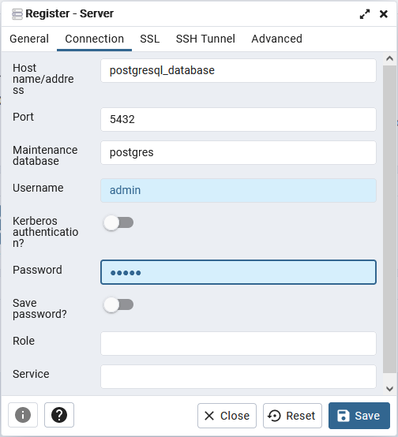

# EventsScraper
Application which search information about cultural events and collect in one place

## Descritpion
Application to collect cultural events. Optionally chat on side

## Technology
- Java
- Spring
- TBD

## How to prepare dev environment
- Open command line in EventScraper directory
- Run command:  ```docker-compose up -d```
- Now you can run application from your IDE

## Info about environment
- PostgreSQL exposed port: ```:5432```
- PostgreSQL credential:
  - user: ```admin```
  - password: ```admin```
- PgAdmin available on: ```http://localhost:5050```
- PostgreSQL credential:
  - user: ```admin@admin.com```
  - password: ```admin```


